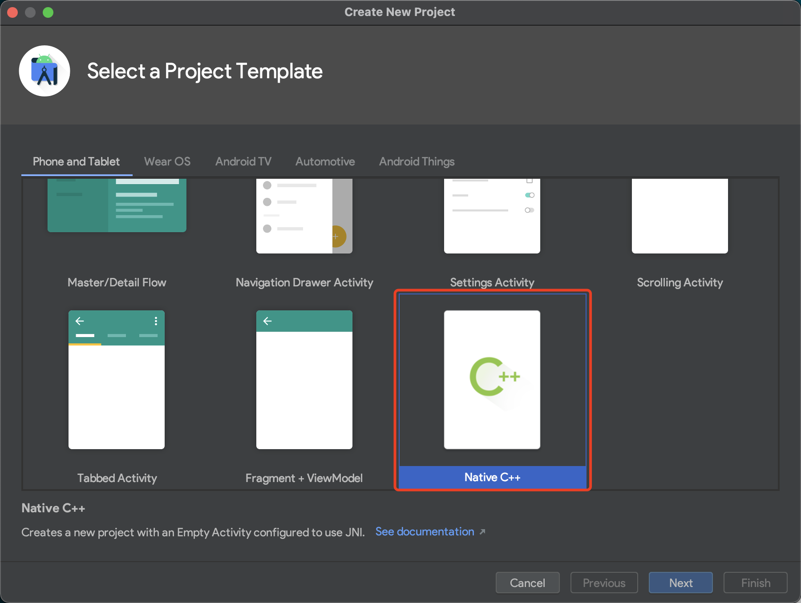

### 项目目录说明

这是 speex 编解码的使用说明。如果对jni还不熟悉，可以查看[JNI编程基础](https://github.com/YaowenGuo/AndroidQA/blob/master/Android/jni/jni.md)， 如果想要对项目进行改造，请查看[Speex在Android中使用](/speex.md)。

C 库， speex 的编解码，降噪和去回声都在jni目录下。还有自己编写的函数，使用时将其拷贝到app/src/main目录下

> jni 结构

```
jni 该目录是android studio 的c程序根目录
 |- include 包libspeex编解码,libspeexdsp降噪和去回声的头文件被合并在此
 |- libspeex 编解码的库
 |- libspeexdsp 降噪和去回声的库
 |- Android.mk 编译的makefile规则
 |- Application.mk 生成so库的架构，如果不需要这么多，可以去掉一些
 |- speex_util.h 使用javah 指令生成的头文件，每次改动java native方法都要从新生成，同时拷贝到它的实现文件。
 |- speex_util.c 自己对speex的封装
 |- srocess_set.h 自己编写c库内部要用到的声明。
```

有一些博客上使用配置 `Externel Tools` 的方式，这种方式比较老旧了。如果你对其看兴趣，可[查看](externel_tools_config.md)。这里使用新的方式配置编译 native 代码。

### 配置 Gradle 编译代码。

如果是在已有项目中添加 Native，课直接跳过第一步。

1. 如果是新建项目，选择新建 C++ 项目可以默认添加 Native 的编译。




就回在 app 的 `build.gralde`  发现配置 Native 编译的 gradle 配置。

```groovy
android {

    defaultConfig {
        ...
        externalNativeBuild {
            cmake {
                cppFlags ""
            }
        }
    }

    externalNativeBuild {
        cmake {
            path "src/main/cpp/CMakeLists.txt" // CMake 文件目录
            version "3.10.2" // CMake 版本。
        }
    }
}

```


2. 然而大多数情况下，是在已有项目的添加 Native 编译

这时候在左侧项目栏中鼠标右键要添加 Native 配置的模块，在弹出的菜单中选择 `Link C++ Project with Gradle`。此时回弹出一个弹窗，选择该模块中 Native 编译的 `Android.mk` 或者 `CMakeLists.txt`。 Gradle 会根据文件自动生成 `ndkBuild` 或者 CMake 的 gradle 配置。


如果是 `Android.mk` 则会在该模块的 `build.gradle` 文件中生成：

```groovy
android {
    ndkVersion '21.3.6528147' // 自己诶外添加的，课制定 ndk 的版本。
    externalNativeBuild {
        ndkBuild {
            path file('src/main/jni/Android.mk')
        }
    }
}
```

制定生成的 abi

```groovy
android {
    defaultConfig {
        ...
        externalNativeBuild {
            ndkBuild {
                buildTypes {
                    abiFilters 'armeabi-v7a' // 课制定多种 abi
                }
            }
        }
    }
}
```

debug 和 release 指定不同的 abi

```
android {
    defaultConfig {
        ...
        externalNativeBuild {
            ndkBuild {
                debug {
                    abiFilters 'armeabi-v7a', 'x86'
                }
                release {
                    abiFilters 'armeabi-v7a'
                }
            }
        }
    }
}
```

这些配置完成后，就回自动生成 so 文件并打包在 apk 中。


### java native 方法和ogg 文件格式处理

> 目录结构介绍

speex  该目录是处理native和ogg文件格式的类
 |- speex.java java native方法定义的地方。
 |- AudioRecordRunnable.java 录音的方法
 |- ProcessSpeexRunnable.java 压缩和解压缩的方法。
 |- WriteSpeexOggFileRunnable.java 将 压缩后的内容写入文件的方法


关于Ogg 的文件格式，可以查看http://blog.csdn.net/yu_yuan_1314/article/details/16884313

使用说明：
AudioRecordRunnable.java, ProcessSpeexRunnable.java, WriteSpeexOggFileRunnable.java  三个分别是 音频的采集、处理、文件存储，这些文件来自 https://www.javatips.net/api/LEHomeMobile_android-master/common/src/main/java/my/home/common/speex/WriteSpeexOggFileRunnable.java#
我再此基础上进行了改造，方便重复录音和链式使用。你可以对比两者来查看，这部分的代码写的还是非常棒的。

使用时首先需要初始化，
```java
mRecordThread = new Thread(mAudioRecorderRunnable = new AudioRecorderRunnable( null));

mAudioRecorderRunnable.setSpeexProcess(null)
                .saveFile(new File(Environment.getExternalStorageDirectory().getAbsolutePath() + "/recoding/A.spx"), null);
```


然后调用Thread 的.start方法开始录音， 调用 AudioRecorderRunnable的 stop方法停止录音， 这些都是链式调用的，AudioRecorderRunnable的 stop方法调用后，会自动停止编解码和文件存储。
