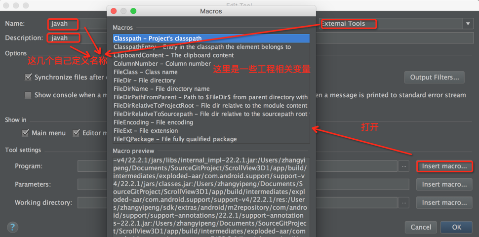
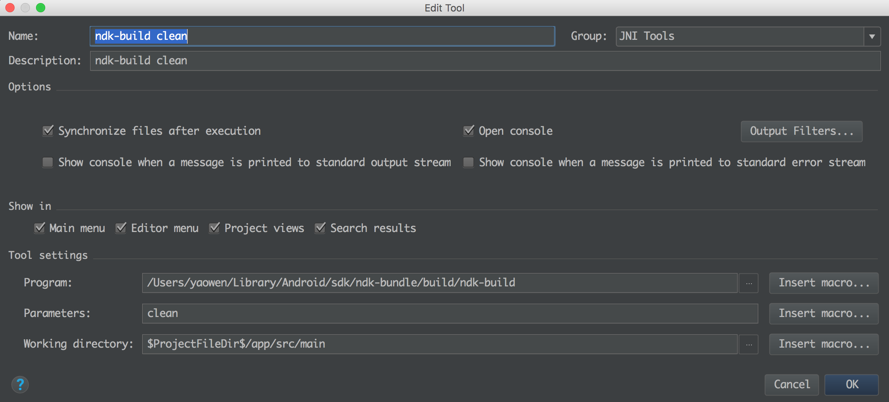
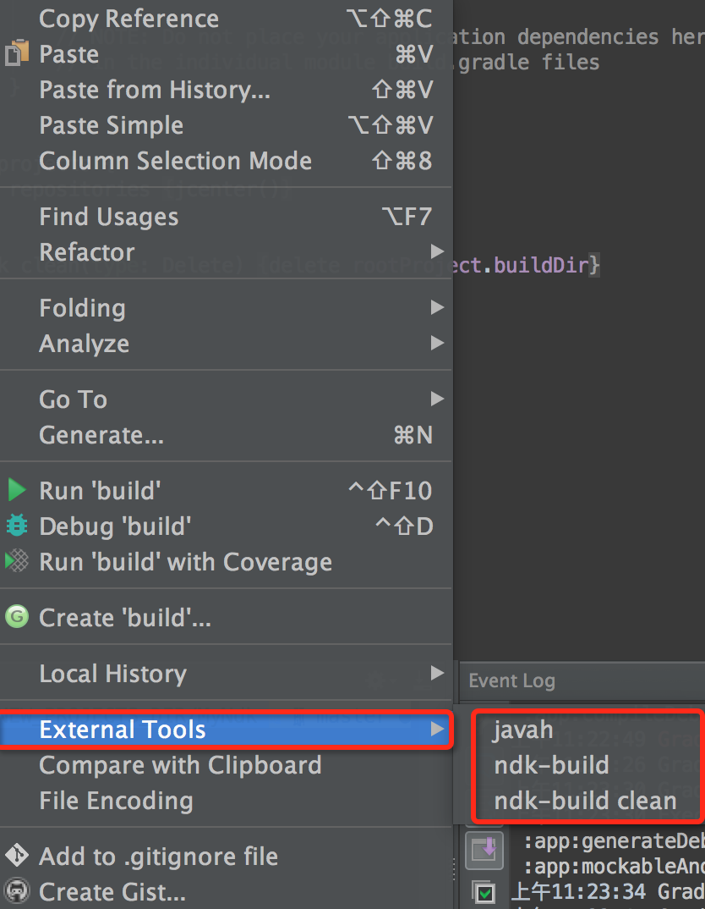

### 项目目录说明

这是是该项目 speex 编解码的使用说明。如果对jni还不熟悉，可以查看[JNI编程基础](/jni.md)， 如果想要对项目进行改造，请查看[Speex在Android中使用](/speex.md)。

C 库， speex 的编解码，降噪和去回声都在jni目录下。还有自己编写的函数，使用时将其拷贝到app/src/main目录下

> jni 结构

jni 该目录是android studio 的c程序根目录
 |- include 包libspeex编解码,libspeexdsp降噪和去回声的头文件被合并在此
 |- libspeex 编解码的库
 |- libspeexdsp 降噪和去回声的库
 |- Android.mk 编译的makefile规则
 |- Application.mk 生成so库的架构，如果不需要这么多，可以去掉一些
 |- speex_util.h 使用javah 指令生成的头文件，每次改动java native方法都要从新生成，同时拷贝到它的实现文件。
 |- speex_util.c 自己对speex的封装
 |- srocess_set.h 自己编写c库内部要用到的声明。

复制了代码之后还是不能够使用，因为还没有编译，首先配置编译指令：

### 确保Android studio 配置了 NDK，

点击SDK Manger -&gt; SDK Tools -&gt; NDK -&gt; 点击Apply


并且在项目的 gradle.properties 中添加一行 android.useDeprecatedNdk=true。不过我发现我没有配置也是可以使用的。  


如果你是自己下载的NDK包解压的 你还需在local.properties 中添加NDK位置  
ndk.dir=/Users/yaowen/Library/Android/sdk/ndk-bundle

### 配置生成apk时链接的so库位置
在 Module的 gradle中添加如下内容：

```
android {
    ...
    defaultConfig {
        ...
        ndk {
            moduleName "libspeex"  // 指定连接时 c 动态链接库的名字
            // 指定链接哪些架构的库，会根据用于不同架构的apk链接不同的类型
            abiFilters 'armeabi','arm64-v8a', 'x86', 'armeabi-v7a'
        }
        sourceSets.main {
            jni.srcDirs = []
            // 指定so库的位置，用于生成apk时链接时进apk，这里指定了两个。
            jniLibs.srcDirs = ['src/main/jniLibs', 'src/main/libs']

        }
    }
}
```

### 配置编译so库

Android Studio （菜单栏最左边）-&gt; Preferences \[或者command+,直接打开\]-&gt; Tools -&gt; External Tools -&gt; 点击➕号进行添加：

  
点击+号之后，打开Macros 配置宏命令界面，如下图：  


> javah 指令的配置如下：

Program:  $JDKPath$\bin\javah.exe   
Parameters: -classpath . -jni -o $ModuleFileDir$/src/main/jni/$Prompt$  $FileClass$   
Working directory:  $ModuleFileDir$\src\main\java  


参数有依赖文件的话需要加入依赖库  
-bootclasspath$ModuleSdkPath$/platforms/android-21/android.jar

> build 和 clean 指令的配置如下：

Program: ~/Library/Android/sdk/ndk-bundle/build/ndk-build  
Parameters: 如果想要强制重新编译: -B 如果想要清理: clean  
Working dicrectory: $ProjectFileDir$/app/src/main  
或者   
Working directory: $ModuleFileDir$\src\main




** 注意，上面的的Program最好打开目录选择，手动输入容易出错**

2.配置完成就可以使用javah 、ndk-build、ndk-build clean这三个命令了，那么在哪里使用这些命令，鼠标点击Moudule中的一个文件，右键就能找到：请看下图




### 编译

鼠标点击Android studio中的jni 目录，或者它的上级目录都行，选择 External Tools -> ndk-build 进行编译，就会发现在main/java/libs目录下生成了相应的so文件。


### java native 方法和ogg 文件格式处理

> 目录结构介绍

speex  该目录是处理native和ogg文件格式的类
 |- speex.java java native方法定义的地方。
 |- AudioRecordRunnable.java 录音的方法
 |- ProcessSpeexRunnable.java 压缩和解压缩的方法。
 |- WriteSpeexOggFileRunnable.java 将 压缩后的内容写入文件的方法


关于Ogg 的文件格式，可以查看http://blog.csdn.net/yu_yuan_1314/article/details/16884313

使用说明：
AudioRecordRunnable.java, ProcessSpeexRunnable.java, WriteSpeexOggFileRunnable.java  三个分别是 音频的采集、处理、文件存储，这些文件来自 https://www.javatips.net/api/LEHomeMobile_android-master/common/src/main/java/my/home/common/speex/WriteSpeexOggFileRunnable.java#
我再此基础上进行了改造，方便重复录音和链式使用。你可以对比两者来查看，这部分的代码写的还是非常棒的。

使用时首先需要初始化，
```java
mRecordThread = new Thread(mAudioRecorderRunnable = new AudioRecorderRunnable( null));

mAudioRecorderRunnable.setSpeexProcess(null)
                .saveFile(new File(Environment.getExternalStorageDirectory().getAbsolutePath() + "/recoding/A.spx"), null);
```


然后调用Thread 的.start方法开始录音， 调用 AudioRecorderRunnable的 stop方法停止录音， 这些都是链式调用的，AudioRecorderRunnable的 stop方法调用后，会自动停止编解码和文件存储。
