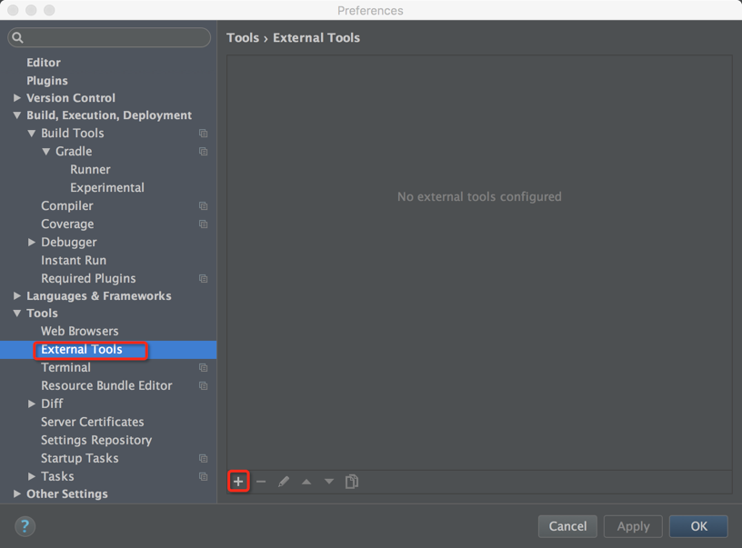
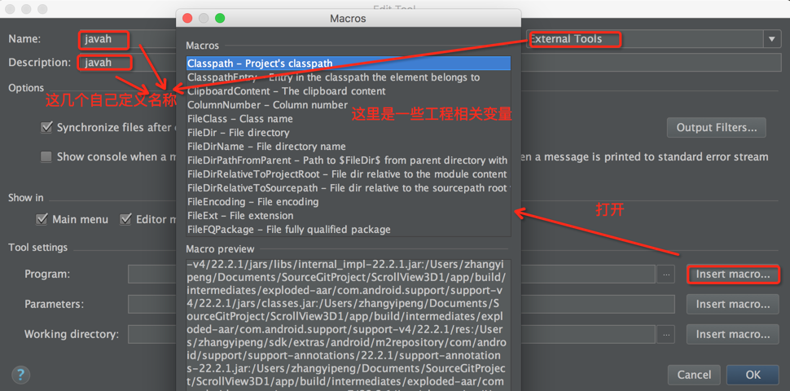
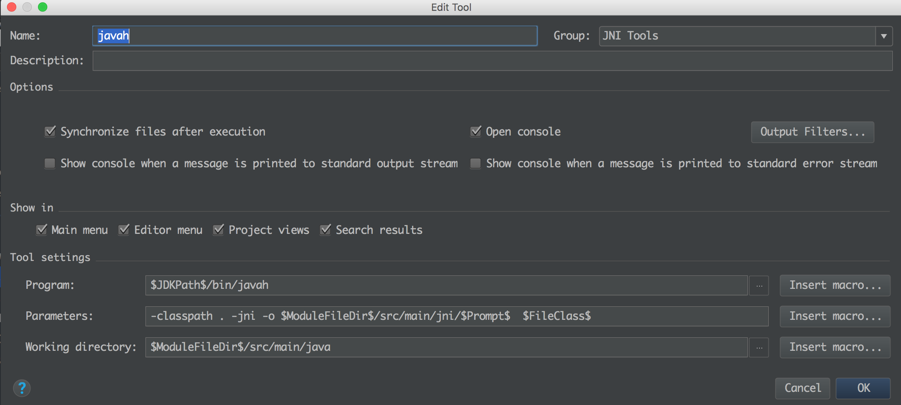
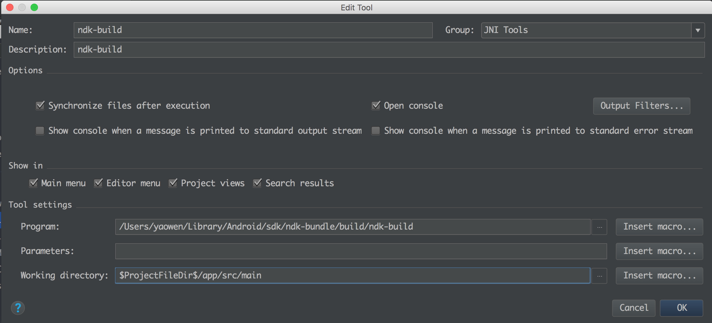
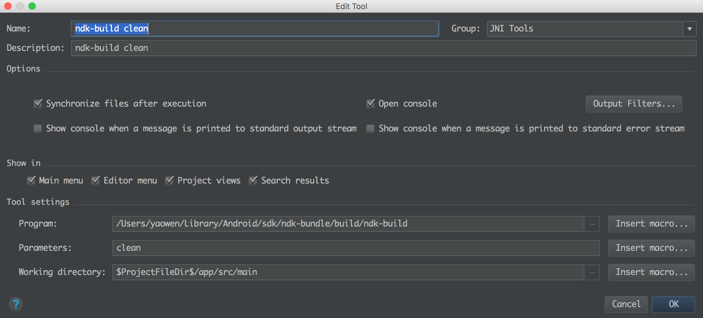
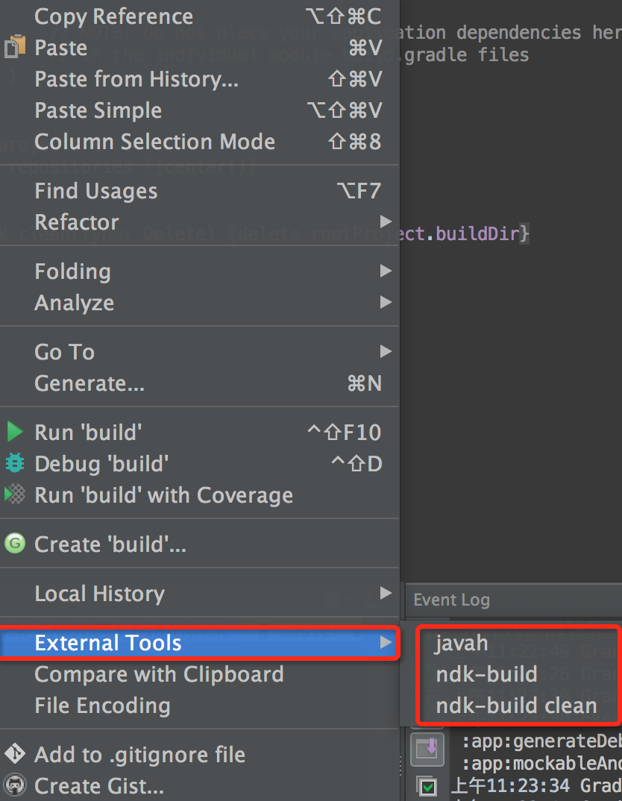

### 确保Android studio 配置了 NDK，

点击SDK Manger -&gt; SDK Tools -&gt; NDK -&gt; 点击Apply


并且在项目的 gradle.properties 中添加一行 android.useDeprecatedNdk=true。不过我发现我没有配置也是可以使用的。  


如果你是自己下载的NDK包解压的 你还需在local.properties 中添加NDK位置  
ndk.dir=/Users/yaowen/Library/Android/sdk/ndk-bundle

### 配置生成apk时链接的so库位置
在 Module的 gradle中添加如下内容：

```
android {
    ...
    defaultConfig {
        ...
        ndk {
            moduleName "libspeex"  // 指定连接时 c 动态链接库的名字
            // 指定链接哪些架构的库，会根据用于不同架构的apk链接不同的类型
            abiFilters 'armeabi','arm64-v8a', 'x86', 'armeabi-v7a'
        }
        sourceSets.main {
            jni.srcDirs = []
            // 指定so库的位置，用于生成apk时链接时进apk，这里指定了两个。
            jniLibs.srcDirs = ['src/main/jniLibs', 'src/main/libs']

        }
    }
}
```

### 配置编译so库

Android Studio （菜单栏最左边）-&gt; Preferences \[或者command+,直接打开\]-&gt; Tools -&gt; External Tools -&gt; 点击➕号进行添加：

  
点击+号之后，打开Macros 配置宏命令界面，如下图：  


> javah 指令的配置如下：

Program:  $JDKPath$\bin\javah.exe   
Parameters: -classpath . -jni -o $ModuleFileDir$/src/main/jni/$Prompt$  $FileClass$   
Working directory:  $ModuleFileDir$\src\main\java  



参数有依赖文件的话需要加入依赖库  
-bootclasspath$ModuleSdkPath$/platforms/android-21/android.jar

> build 和 clean 指令的配置如下：

Program: ~/Library/Android/sdk/ndk-bundle/build/ndk-build  
Parameters: 如果想要强制重新编译: -B 如果想要清理: clean  
Working dicrectory: $ProjectFileDir$/app/src/main  
或者   
Working directory: $ModuleFileDir$\src\main





** 注意，上面的的Program最好打开目录选择，手动输入容易出错**

2.配置完成就可以使用javah 、ndk-build、ndk-build clean这三个命令了，那么在哪里使用这些命令，鼠标点击Moudule中的一个文件，右键就能找到：请看下图




### 编译

鼠标点击Android studio中的jni 目录，或者它的上级目录都行，选择 External Tools -> ndk-build 进行编译，就会发现在main/java/libs目录下生成了相应的so文件。

